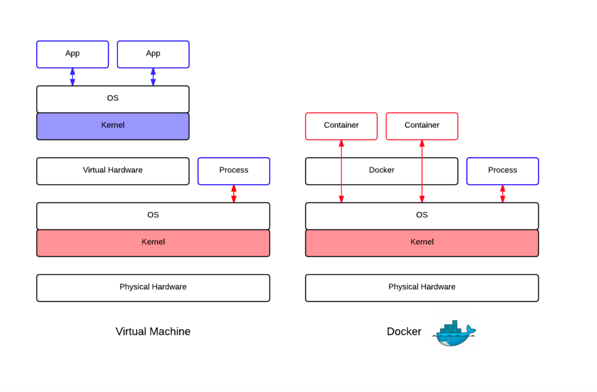
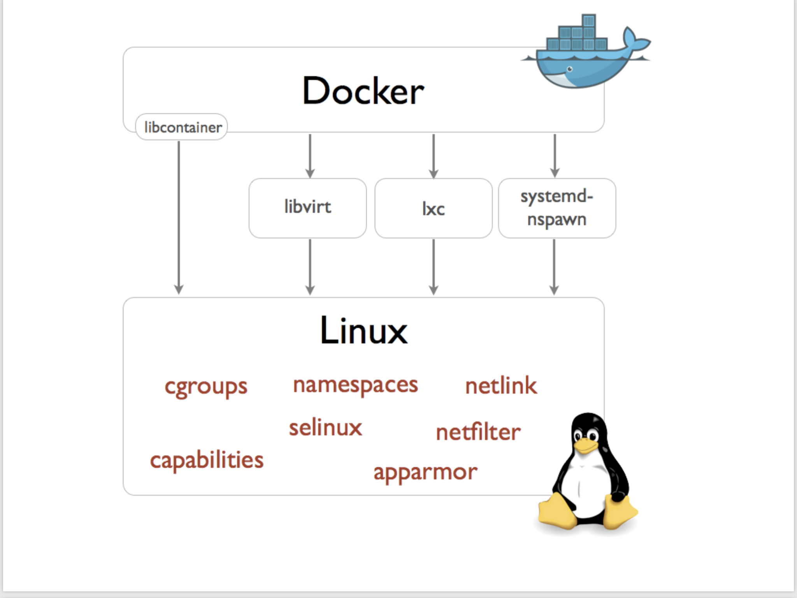
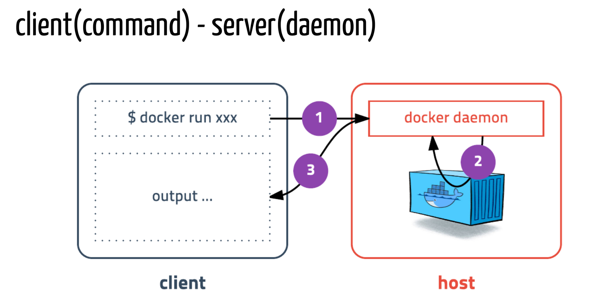

# Docker

## 0. README

T아카데미의 도커 강의를 듣고 정리한 내용들입니다.

## 1. Tutorials

`docker run -it ubuntu:latest echo "hello, world"`

`docker run -it ubuntu:latest bash`
이 상태는 현재 우분투에 접속한 상태이다. `cat /etc/lsb-release`명령어로 우분투 터미널 내에 정보를 출력해보면 아래와 같은 메시지가 결과로 나온다.
```
root@c81de8a0fe10:/# cat /etc/lsb-release
DISTRIB_ID=Ubuntu
DISTRIB_RELEASE=18.04
DISTRIB_CODENAME=bionic
DISTRIB_DESCRIPTION="Ubuntu 18.04 LTS"
```


`docker run -it cents:latest bash` 명령어를 입력하면,  centos환경을 사용할 수 있다. 마찬가지로 `cat /etc/centos-release`명령어로 사용 중인 환경에 대해 알 수 있다.

현재 사용중인 컨테이너의 정보를 알고 싶다면 별도의 터미널을 열어서 `sudo docker ps -a`를 입력해주면 된다. 입력해주면 아래와 같은 결과가 나온다.


이번엔 busybox를 이용해본다. busybox는 리눅스 커널 중 최소한의 기능들로만 구성된 가벼운 컨테이너라고 생각하면 된다. 다른 컨테이너에 비해 용량이 현저히 적다.
리눅스 배포판이 아닌 리눅스 커널을 실행할 수 있는 환경 + 툴들이 설치되어 있는 환경이다.

`busybody | head -n 1`명령어로 현재 busybox에 대한 정보를 알 수 있다. 결과는 아래와 같다.
`BusyBox v1.28.4 (2018-05-22 17:00:17 UTC) multi-call binary.`


## 2. Basic Concepts

### 2.1 컨테이너

* 각각의 VM = 서로 다른 환경
  VM은 하드웨어의 가상화: 소프트웨어로 구현된 하드웨어

* 각각의 컨테이너 = 서로 다른 환경
  * OS에서 지원하는 기능을 사용
  * 격리된 환경에서 프로세스를 실행



도커의 컨테이너는 `하드웨어의 가상화 없이 격리된 환경에서 실행되는 프로세스`이다 . 도커의 컨테이너는 프로세스라는 점이 중요하다.

**chroot**: 루트 디렉토리를 바꿔주는 역할을 하는 도구, 도커가 나오기 전에 사용되었던 것이다. 단 이 방법을 사용하기 위해서는 의존성을 확인한 후 각종 라이브러리를 가져와야 하는 불편한 작업이 수반된다.

예를 들어, 본래 /bin에 있었던 bash를 가져온다고 가정해보면 bash만 가져올 것이 아니라 `ldd bash`명령어로 필요한 의존성 라이브러리들을 파악한 후에 함께 복사해와야 실행이 가능하다.
실제로 컨테이너라는 건 **chroot**와 같은 격리기능을 좀 더 편리하게 제공해주는 것이라고 생각할 수 있다.



도커의 경우 처음 lxc(linux container)를 이용해 격리를 했었고, 지금의 경우 libcontainer라는 라이브러리를 도커사에서 개발을 해서 사용하고 있다.

`docker run -p 3306:3306 --name mysql -d mysql` 명령어로 mysql을 실행시켜보자. 도커 안에서 실행되는 포트랑 밖에서의 포트랑 연결시켜주는 옵션이 `-p 3306:3306` 옵션이다. 

### 2.2 이미지

* 특정 프로세스를 실행하기 위한 환경
  * 계층화된 파일 시스템
  * 이미지는 파일들의 집합
  * 프로세스가 실행되는 환경도 결국 파일들의 집합

### 2.3 도커 서버와 클라이언트

* 리눅스 머신
  * 컨테이너를 네이티브하게 지원해준다. 컨테이너 = 호스트의 프로세스
  * 배포판에 따라 차이는 있지만 대부분 지원한다.
  * 실제 도커 컨테이너 배포에는 리눅스 머신을 사용한다.
* 맥
  * xhyve, 직접 컨트롤 할 수는 없지만 이 위에서 서버 및 컨테이너가 존재한다.
    * 클라이언트는 맥OS에 직접 설치되어 있다. 
    * xhyve는 맥OS의 경량화된 가상머신이다.
  * 호스트 머신과 자연스럽게 결합
    * 네트워크 / 볼륨 등
    * 호스트 머신처럼 사용 가능
* 맥OS와 가상머신
  * 일반적인 가상 머신
  * 컨테이너 = 가상 머신의 프로세스
  * 네트워크 / 볼륨 설정이 까다롭다.
  * 클라이언트는 환경변수를 참조해서 서버에 접속


### 2.4 컨테이너가 필요한 이유

* 컴퓨터의 환경은 보편적이지 않다.
  각각의 컴퓨터에서 mysql을 실행해본다고 생각해보자. 특정 하드웨어, OS, 특정 시점의 시스템 설정 등에 따라 전부 다르다. 통일할 수 있는 방법이 마땅히 존재하지 않는다.
* 상태 관리 및 서버관리는 정말 어렵다. 데스크톱도 똑같이 어렵다.
* 깨끗한 환경
  Dockerfile이란 깨끗환 환경(리눅스를 처음 설치했을 때와 같이)으로부터 애플리케이션 실행 환경까지의 최단 경로다. 
  최소한의 파일들만 모으는 작업이라고 생각하면 된다.
* 이미지 = 작동되는 상태이다. 이미지로 만들어 두고, 내가 실행시키고 싶은 프로세스를 정해주기만 하면 된다.
* 10명의 맥북이 있다면, 10개의 서로 다른 환경이 있지만, 하나의 이미지는 리눅스 환경에서 이 이미지를 사용할 때는 항상 같은 환경이라는 점을 보장할 수 있다.
* 초강력한 포터블 앱이다. 어떤 애플리케이션을 실행하기 위한 다양한 파일을 모아두고, 이것만 실행하면 된다.
* 재현성: 이미지로 만들면 어디든 공유가 가능하다. 여기서 되면 저기서도 된다.
* 오버헤드가 크지 않다. 만약 있다면, scale out 등으로 해결한다. 성능면에서 가상머신과 크게 문제 없다.


## 3. 실습하기

### 3.1 Agenda

* 컨테이너 실행하기 `run`
* 컨테이너 목록 확인하기 `ps`
* 컨테이너 중지하기 `stop`
* 컨테이너 제거하기 `rm`
* 컨테이너 로그보기 `logs`
* 이미지 목록 확인하기 `images`
* 이미지 다운로드하기 `pull`
* 이미지 삭제하기 `rmi`
* 네트워크 만들기 `network`
* 볼륨 마운트 `-v`
* Docker Compose


### 3.2 Mac or Windows

도커는 linux만 지원하기 때문에 MacOS와 Windows에 설치되는 Docker는 실제로 가상머신에 설치된다. MacOS는 `xhyve`를 사용하고 Windows는 `Hyper-V`를 사용한다.

설치가 제대로 되었는지 아래의 명령어와 결과로 확인해보자.

```
$ docker version
Client:
 Version:      18.03.1-ce
 API version:  1.37
 Go version:   go1.9.5
 Git commit:   9ee9f40
 Built:        Thu Apr 26 07:13:02 2018
 OS/Arch:      darwin/amd64
 Experimental: false
 Orchestrator: swarm

Server:
 Engine:
  Version:      18.03.1-ce
  API version:  1.37 (minimum version 1.12)
  Go version:   go1.9.5
  Git commit:   9ee9f40
  Built:        Thu Apr 26 07:22:38 2018
  OS/Arch:      linux/amd64
  Experimental: true
```




### 3.3 컨테이너 실행하기

`docker run [OPTIONS] IMAGE[:TAG|@DIGEST][]COMMAND] [ARG...]`

|   옵션    |                          설명                          |
| :-------: | :----------------------------------------------------: |
|    -d     |       detached mode: 흔히 말하는 백그라운드 모드       |
|    -p     |        호스트와 컨테이너의 포트를 연결 (포워딩)        |
|    -v     |      호스트와 컨테이너의 디렉토리를 연결 (마운트)      |
|    -e     |          컨테이너 내에서 사용할 환경변수 설정          |
|  --name   |                   컨테이너 이름 설정                   |
|   --rm    |           프로세스 종료시 컨테이너 자동 제거           |
|    -it    | -i와 -t를 동시에 사용한 것으로 터미널 입력을 위한 옵션 |
| --network |                     네트워크 연결                      |

#### ubuntu 16.04

`docker run ubuntu:16.04`

`run`명령어를 사용하면 사용할 이미지가 저장되어 있는지 확인하고 없으면 다운로드(`pull`)를 한 후 컨테이너를 생성(`create`)하고 시작(`start`)한다.

컨테이너는 프로세스이기 때문에 실행중인 프로세스가 없으면 컨테이너는 종료된다.

#### /bin/sh

`docker run --rm -it ubuntu:16.04 /bin/sh`

컨테이너 내부에 들어가기 위해 `sh`를 실행하고 키보드 입력을 위해 `-it`(== -i, -t)옵션을 준다. 추가적으로 프로세스가 종료되면 컨테이너가 자동으로 삭제되도록 --rm 옵션도 추가하였다.

`--rm`옵션이 없다면 컨테이너가 종료되더라도 삭제되지 않고 남아있다.

#### CentOS

`docker run --rm -it centos:7 /bin/sh`

도커는 다양한 리눅스 배포판을 실행할 수 있다. 공통점은 모두 동일한 커널을 사용한다는 점이다. Ubuntu 또는 CentOS에 포함된 다양한 기본기능이 필요 없는 경우, Alpine이라는 초소형(약 5MB)이미지를 사용할 수도 있다.

#### Web Application

간단한 웹 애플리케이션을 컨테이너로 생성해본다.

아래의 실습의 경우, 강사가 운영하는 서버에 접속하는 작업인데 실제로 현재 강사가 운영하는 서비스를 볼 수 없으므로..! 실습에 미흡함이 있다.

#### Web Application v2

```
docker run -d \                                                                         
> -p 4568:4567 \
> -e ENDPOINT=https://workshop-docker-kr.herokuapp.com/ \
> -e PARAM_NAME=waca \
> subicura/docker-workshop-app:2
```

명령어를 여러 줄 칠 수 없기 때문에 역슬래쉬를 붙여주면서 개행을 시킨다.

-d 옵션으로 백그라운드 실행을 시키고, 로컬의 4568 포트를 호스트의 4567연결을 할 것이기 때문에 로컬 호스트의 4568포트로 접속을 하면 웹 접속이 될 것이다.

-e의 경우 환경변수를 넘겨주는 옵션이다. 

실행시킨 후에는 자신의 ip주소:port번호(4568)를 브라우저에 입력해보자. 그러면 자신의 container의 id가 화면에 보일 것이다.

옵션을 다시한 번 설명하자면, -d 옵션을 주지 않으면 실행된 상태로 멈추게 되고 -p 옵션은 4568을 컨테이너 안의 4567로 연결하겠다는 뜻이다. -e는 환경 변수를 지정하겠다는 뜻이고 총 2개의 환경변수를 지정했다. ENDPOINT라는 환경변수, 그리고 PARAM_NAME 환경변수를 각각 설정해주었다.

subicura라는 계정 안에 있는 도커 워크숍 앱 2번째 버전이라는 의미다. 유명한 컨테이너 같은 경우 앞에 아이디가 없는데, 사용자가 만든 것은 앞에 아이디가 붙고 / image명이 붙고 뒤에 태그까지 붙일 수 있다.

#### Web Application v3

```
docker run -d \                                                                         
> -p 4569:4567 \
> -e ENDPOINT=https://workshop-docker-kr.herokuapp.com/ \
> -e PARAM_NAME=waca \
> -e PARAM_MESSAGE=wise \
> subicura/docker-workshop-app:3
```

실습의 의미:

이미지에 태그를 달아서 누군가가 관리를 하면, 그 이미지를 가져다 쓰기만 하면 된다는 의미이다. 

웹 애플리케이션이 브라우저에서 접속을 하면, 서버에다가 파라미터 값을 전달하는 프로그램인데 내부적으로 Ruby언어로 만들어져 있지만 실제 컨테이너를 사용하는 사용자 입장에서는 이런 걸 신경쓰지 않아도 된다.

예전 같으면 프로그램이 어떤 언어로 만들어져있는지 알고 있어야 했지만, 이제 제작자가 이미지를 신경써서 만들기만 한다면 개발에 필요한 건 어떤 환경변수를 써야 하는지, 어떤 포트를 사용해야하는지 정도이다. 이미지 파일 자체는 이미 실행되는 이미지 이므로 안심하고 사용할 수 있다.

마지막에 기술된 것이 이미지이고, 아무 설정을 넣어주지 않는다면 프로그램 자체가 실행된다. 

#### Reids

redis는 메모리기반의 다양한 기능을 가진 스토리지이다.

`docker run -name=redis -d -p 1234:6379 redis`

백그라운드로 동작하고 호스트의 1234를 컨테이너의 6379라는 포트와 연결을 해서 사용하겠다는 의미다.

`telnet` 프로그램으로 테스트 해본다.

```
# mac
docker run --rm -it mikesplain/telnet docker.for.mac.localhost 1234
// 가상 머신에서 telnet을 실행시킨 것을 그대로 호스트에서 프로세스로 동작시키는 것과 같은 효과를 줄 수 있다.
// telnet이라는 프로그램 자체가 컨테이너에서 실행되는 것이기 때문에, 컨테이너에서는 밖에 있는 호스트의 ip를 모르기 때문에 docker.for.mac.localhost라는 도커에서 만들어준 DNS를 활용해서 접속할 수 있다.
// telnet은 이미지고 그 뒤에 어떤 인자를 붙일지 어떻게 아냐라고 물어본다면, 그 방법이 없기 때문에 만든 사람이 어떻게 만들었는지를 알아야 한다. 사용법은 구글링을 통해 알아내도록 하자.
# windows
docker run --rm -it mikesplain/telnet docker.for.win.localhost 1234

set hello world
+OK
get hello
$5
world
quit
```

#### MySQL

보통 명령어는 [docker hub mysql](https://hub.docker.com/_/mysql/) 를 검색해서 어떤 옵션(환경 변수)이 있는지 확인해본다.

```
docker run -d -p 3306:3306 \
	-e MYSQL_ALLOW_EMPTY_PASSWORD=true \
	--name mysql \
	mysql:5.7
```

mysql에 접속하여 database를 만든다.

```
docker exec -it mysql mysql // mysql컨테이너에 접근해서 mysql커맨드를 실행시킨다.
create database wp CHARACTER SET utf8;
grant all privileges on wp.* to wp@'%' identified by 'wp';
flush privileges;
quit
```

#### exec

`exec`명령어는 `run`과는 달리 실행중인 도커 컨테이너에 접속할 때 사용하며 일반적으로 컨테이너 안에 ssh server등을 설치하지 않고 exec 명령어로 접속한다.

#### Wordpress

```
docker run -d -p 8080:80 \                                                              
> -e WORDPRESS_DB_HOST=docker.for.mac.localhost \
> -e WORDPRESS_DB_NAME=wp \
> -e WORDPRESS_DB_USER=wp \
> -e WORDPRESS_DB_PASSWORD=wp \
> wordpress
```

이미지에 필요한 환경변수만 안다면, 프로세스를 빠르게 실행시킬 수 있다. `localhost:8080` 을 웹브라우저에서 확인해보자.

#### ps

`docker ps` 로 현재 만들어진 컨테이너 목록을 확인해보자.

`docker ps -a` 옵션은 중지된 컨테이너도 출력해준다.

#### stop

`docker stop [OPTIONS] CONTAINER [CONTAINER...]`

컨테이너 아이디 옵션을 줄 때는 앞에 3글자만 따서 입력을 해줘도 도커에서 인식을 해주기 때문에 `docker stop 395 967 38a`  등 여러 아이디를 줘서 여러 개를 중지시킬 때 유용하게 사용할 수 있다.

#### rm

종료 뿐만 아니라 rm 명령어로 확실히 삭제를 해주도록 한다.

`docker rm 395 976 38a b50 e02 10c 1c3 ac8 b1a 8b1 d7a` 과 같이 주어 한꺼번에 여러 컨테이너를 종료시켜주었다.

#### logs

컨테이너가 정상적으로 동작하는지 확인하기 위해 로그를 사용한다. 

`docker logs [OPTIONS] CONTAINER`

`-f`, `--tail` 옵션을 함께 사용하여 좀 더 효과적으로 사용할 수 있다.

#### imgaes

`docker images [OPTIONS][]REPOSITORY[:TAG]]`

`docker images`

다운로드 된 이미지 목록을 확인할 수 있다.

#### pull

이미지를 다운받는 명령은 다음과 같다.

`docker pull [OPTIONS] NAME[:TAG|@DIGEST]`

ubuntu:14.04를 다운받기 위해서는

`docker pull ubuntu:14.04`

run명령어를 입력하면 이미지가 없을 때 자동으로 다운받으니 pull명령어를 언제 쓰는지 궁금할 수 있다. pull은 최신버전으로 다시 다운 받는다. 같은 태그지만 이미지가 업데이트 된 경우는 pull 명령어를 통해 새로 다운받을 수 있다.

#### rmi

이미지를 삭제하는 방법은 다음과 같다.

`docker rmi [OPTIONS] IMAGE [IMAGE...]`

imgaes 명령어를 통해 얻은 이미지 목록에서 이미지 ID를 입력하면 삭제가 된다. 단, 컨테이너가 실행중인 이미지는 삭제되지 않는다. 컨테이너는 이미지 레이어를 기반으로 실행중이므로 당연히 삭제할 수 없다.

#### network create

도커 컨테이너끼리 통신할 수 있는 가상 네트워크를 만든다.

`docker network create [OPTIONS] NETWORK`

`app-network` 라는 이름으로 wordpress와 mysql이 통신할 네트워크를 만든다.

`docker network create app-network`

#### network connect

기존에 생성된 컨테이너에 네트워크를 추가한다.

`docker network connect [OPTIONS] NETWORK CONTAINER`

만들어 놓은 mysql에 네트워크를 추가한다.

`docker network connect app-network mysql`


